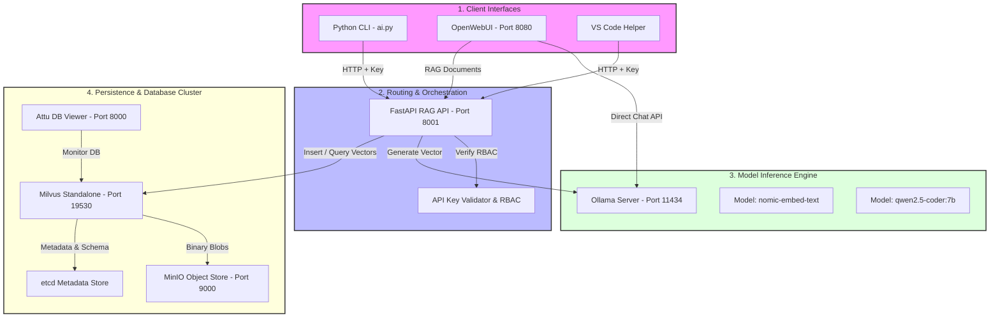

# 🏗️ System Architecture & Design

This document details the system design, data flows, and architectural components of the **LLM_AI** local RAG-Enabled platform. 

---

## 🗺️ High-Level System Architecture

The LLM_AI platform is composed of several localized microservices orchestrated through Docker Compose, connecting to a locally installed Ollama service for high-performance neural model inference.



---

## 📦 Core Component Breakdown

### 1. Ingestion & Retrieval Layer (FastAPI RAG API)
Written in Python, this microservice exposes REST endpoints to parse uploaded documents, split them into optimal sentences or paragraphs, call Ollama for embedding vector calculations, and index them into Milvus Standalone.

### 2. Vector Database Cluster (Milvus Standalone)
Milvus is a enterprise-grade, highly scalable vector database designed to perform semantic searches at scale. In our standalone Docker deployment, it depends on:
* **etcd**: A distributed metadata store tracking Milvus collections, index states, and partition schemas.
* **MinIO**: An S3-compatible local object store managing the raw data chunks, index logs, and vector storage files.
* **Attu GUI**: A graphical database dashboard useful for monitoring indexing progress, viewing collection volumes, and testing direct similarity lookups.

### 3. Model Inference Engine (Ollama)
Ollama runs directly on the host machine to leverage hardware acceleration (Apple Metal, NVIDIA CUDA, or optimized CPU threading). It hosts:
* **`nomic-embed-text`**: An embedding model that maps paragraphs of text into a high-dimensional mathematical space (768 dimensions), optimizing it for semantic search based on Cosine similarity.
* **`qwen2.5-coder:7b-instruct-q5_K_M`**: A 7.3 Billion parameter language model quantized for maximum CPU efficiency, offering code generation, debugging, and analytical RAG synthesis capabilities.

---

## 🔄 RAG Pipeline Data Flow

The platform executes two primary pipelines: **Document Ingestion** and **Semantic Retrieval**.

### 1. Document Ingestion Pipeline
When a user uploads a document through the REST API or Web UI:
```
[Raw Document]
      │
      ▼
[Text Extraction] ──► Extracts plaintext from PDF, DOCX, TXT, PY, MD.
      │
      ▼
[Text Chunking]   ──► Splits document into chunks (Default: 1000 characters, 200 overlap).
      │
      ▼
[Vector Embedding]──► Passes chunks to Ollama's nomic-embed-text to output 768-d floats.
      │
      ▼
[Milvus Indexing] ──► Inserts vector, chunk_id, and filename metadata into Milvus.
```

### 2. Semantic Retrieval (Query) Pipeline
When a user asks a question with RAG active:
```
[User Search Query]
         │
         ▼
[Vector Embedding]    ──► Converts search text to a 768-d query vector via Ollama.
         │
         ▼
[Milvus Search]       ──► Performs Cosine similarity search in IVF_FLAT vector indices.
         │
         ▼
[Context Retrieval]   ──► Selects the top K chunks with the highest match score.
         │
         ▼
[Prompt Enrichment]   ──► Merges retrieved context + user question into a master prompt.
         │
         ▼
[LLM Inference]       ──► Ollama executes LLM generation using the enriched context.
```

---

## 💾 Milvus Database Schema

The active Milvus collection (`company_documents`) is defined by the following schema:

| Field Name | Data Type | Primary Key | Dimensions / Max Length | Description |
|:---|:---|:---|:---|:---|
| **`chunk_id`** | `VARCHAR` | **Yes** | 100 characters | Unique MD5 hash based on filename + chunk index. |
| **`embedding`** | `FLOAT_VECTOR` | No | 768 dimensions | Vector representations calculated by `nomic-embed-text`. |
| **`text`** | `VARCHAR` | No | 8,000 characters | Raw string content of the paragraph chunk. |
| **`filename`** | `VARCHAR` | No | 500 characters | Name of the source file (e.g. `guide.pdf`). |
| **`doc_type`** | `VARCHAR` | No | 50 characters | Ingestion tag (e.g. `policy`, `code`, `general`). |
| **`chunk_index`**| `INT64` | No | N/A | Numerical order of the chunk in the original file. |

* **Similarity Metric**: Cosine Distance (standardizes scores between -1.0 and 1.0).
* **Index Type**: `IVF_FLAT` (inverted file index providing fast, sub-millisecond retrieval times).

---

## 🔒 Security Architecture

LLM_AI implements strict data isolation, network controls, and authorization boundaries:

1. **Zero Egress (Completely Offline)**: All data processing, vector mathematical maps, database queries, and inference computations execute strictly on your localized hardware. No telemetry or query history leaves your network.
2. **API Access Tokens**: The RAG backend validates the `X-API-Key` using standard SHA-256 hashes against a local JSON register. No database calls are made for authentication.
3. **Role-Based Scope Checks**: Interactive requests are validated against permission tables (`ROLES`) to prevent unauthorized users from deleting document logs or submitting malicious write queries.
4. **Rate Limiting Middleware**: Simple hourly slide-window limits prevent clients from overloading the CPU/GPU server.
